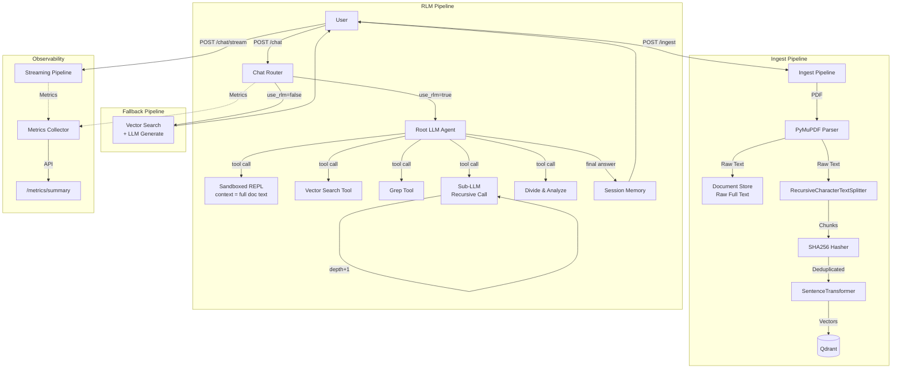

# RLM AI Chat Agent

A production-grade **Recursive Language Model (RLM)** system built with FastAPI, LangChain, Qdrant, and OpenRouter. Unlike traditional RAG pipelines that rely on fixed vector retrieval, this system gives the LLM a sandboxed Python REPL and a suite of tools — letting it _decide_ how to explore documents, call sub-LLMs recursively, and reason its way to an answer.

[](https://opensource.org/licenses/MIT)
[](https://www.python.org/downloads/)
[](https://www.docker.com/)

> **Built on top of the [Production RAG AI Chat Agent](https://github.com/SRV-YouSoRandom/ragagent)** — ~75% of the infrastructure is shared. The RLM core replaces the fixed retrieval pipeline with an agentic reasoning loop.

---

## 🚀 Features

### Core RLM Pipeline

- **Sandboxed REPL** — LLM writes Python to explore document text stored as a variable
- **Recursive Sub-LLM Calls** — Root LLM delegates focused analysis to sub-LLMs on text snippets
- **Divide & Conquer** — Splits large documents into segments and queries each in parallel
- **Keyword Grep** — Fast line-level keyword search across all ingested documents
- **Vector Search Tool** — Semantic retrieval as one of many tools the agent can choose

### Advanced Features

- **Streaming Responses** — Real-time token streaming with agent step visibility
- **Conversational Memory** — Multi-turn conversations with session management
- **Vector Fallback** — Set `use_rlm: false` to use lightweight vector search instead
- **Multi-Collection Support** — Data isolation per user/project/tenant
- **Observability** — Built-in metrics, performance tracking, and optional LangSmith tracing

---

## Architecture Overview



### Data Flow

**Ingestion:**

```
PDF → Parse → Chunk → Hash (dedup) → Embed (384-dim) → Qdrant
                └─→ Raw Full Text → Document Store (for REPL)
```

**RLM Query:**

```
Question → Root LLM Agent Loop:
  ├─ grep_context(keyword)           → line-level matches
  ├─ vector_search(query)            → semantic chunks
  ├─ repl_execute(python_code)       → free-form exploration
  ├─ sub_llm_analyze(instr|||snip)   → focused sub-LLM call
  └─ divide_and_analyze(instr|||doc) → parallel segment analysis
       └─ sub_llm × N segments (recursive)
Final Answer → Save to Memory → Return
```

---

## Project Structure

```
rlm-agent/
├── app/
│   ├── api/
│   │   ├── routes/
│   │   │   ├── ingest.py         # Document ingestion
│   │   │   ├── chat.py           # Chat — routes to RLM or vector fallback
│   │   │   ├── stream.py         # Streaming chat with agent step visibility
│   │   │   ├── collections.py    # Collection management
│   │   │   ├── sessions.py       # Session/memory management
│   │   │   └── metrics.py        # Observability endpoints
│   │   └── dependencies.py       # FastAPI DI
│   ├── core/
│   │   ├── config.py             # Settings — includes RLM-specific config
│   │   ├── logging.py            # Structured logging
│   │   ├── metrics.py            # Metrics collection
│   │   └── tracing.py            # LangSmith integration
│   ├── pipelines/
│   │   ├── ingest.py             # Ingestion — chunks + stores raw text
│   │   └── rlm.py                # RLM agent loop (root + sub-LLM)
│   ├── services/
│   │   ├── parser.py             # PDF text extraction
│   │   ├── chunker.py            # Text splitting
│   │   ├── embedder.py           # Embedding generation
│   │   ├── hasher.py             # SHA256 deduplication
│   │   ├── memory.py             # Conversation memory
│   │   ├── vector_store.py       # Qdrant operations
│   │   ├── document_store.py     # Raw full-text storage for REPL
│   │   ├── repl.py               # Sandboxed Python REPL environment
│   │   ├── sub_llm.py            # Recursive sub-LLM caller
│   │   └── tools.py              # LangChain tools for the root agent
│   ├── schemas/
│   │   ├── chat.py               # Chat request/response + agent step models
│   │   ├── ingest.py             # Ingestion models
│   │   ├── rlm.py                # RLM trace/execution schemas
│   │   ├── collections.py        # Collection models
│   │   └── sessions.py           # Session models
│   ├── main.py                   # FastAPI application
│   ├── Dockerfile
│   └── requirements.txt
├── document_storage/             # Raw full-text store (mounted volume)
├── qdrant_storage/               # Persisted vector data (mounted volume)
├── docker-compose.yml
├── .env.example
├── .gitignore
├── LICENSE
└── README.md
```

---

## Tech Stack

| Component            | Technology                               | Purpose                         |
| -------------------- | ---------------------------------------- | ------------------------------- |
| **Framework**        | FastAPI (Python 3.11)                    | High-performance async API      |
| **Orchestration**    | LangChain                                | Agent loop + tool management    |
| **Vector Database**  | Qdrant                                   | Persistent vector storage       |
| **LLM Provider**     | OpenRouter                               | Access to hosted LLMs           |
| **Embeddings**       | sentence-transformers (all-MiniLM-L6-v2) | Local embedding generation      |
| **REPL Sandbox**     | RestrictedPython                         | Safe code execution environment |
| **Memory**           | In-Memory (upgradeable to Redis)         | Conversation state management   |
| **Document Store**   | File-backed JSON index                   | Raw text persistence for REPL   |
| **Containerization** | Docker & Docker Compose                  | Reproducible deployment         |
| **Observability**    | Custom Metrics + LangSmith (optional)    | Performance monitoring          |

---

## Quick Start

### Prerequisites

- Docker & Docker Compose
- OpenRouter API Key ([Get one free](https://openrouter.ai))

> ⚠️ **Model Note:** The RLM agent requires a model that supports tool/function calling. Ensure the model you configure in `LLM_MODEL` supports this — not all models on OpenRouter do.

### Installation

```bash
# 1. Clone the repository
git clone https://github.com/SRV-YouSoRandom/rlm-agent.git
cd rlm-agent

# 2. Configure environment
cp .env.example .env
nano .env  # Add your OPENROUTER_API_KEY

# 3. Add your user to the docker group (Linux)
sudo usermod -aG docker $USER
newgrp docker

# 4. Create required directories
mkdir -p document_storage qdrant_storage

# 5. Build and run
docker compose up --build -d

# 6. Verify it's running
curl http://localhost:8000/health
```

The API will be available at `http://localhost:8000`

Swagger UI: `http://localhost:8000/docs`

---

## API Usage

### 1. Ingest Documents

Upload PDF documents to the vector store and raw text store.

```bash
curl -X POST http://localhost:8000/api/v1/ingest \
  -F "file=@document.pdf" \
  -F "collection_name=my_docs"
```

**Response:**

```json
{
  "filename": "document.pdf",
  "doc_hash": "a3f5c2...",
  "total_chunks": 42,
  "new_chunks_indexed": 42,
  "collection_name": "my_docs",
  "raw_text_stored": true,
  "raw_text_length": 84321,
  "message": "Document ingested successfully."
}
```

### 2. Chat — RLM Mode (Default)

Ask questions using the full recursive agent pipeline.

```bash
curl -X POST http://localhost:8000/api/v1/chat \
  -H "Content-Type: application/json" \
  -d '{
    "question": "Summarise all the financial figures mentioned across the document",
    "collection_name": "my_docs",
    "use_rlm": true,
    "session_id": null
  }'
```

**Response:**

```json
{
  "answer": "Based on my analysis of the document...",
  "sources": [],
  "collection_name": "my_docs",
  "session_id": "a1b2c3d4-...",
  "agent_steps": [
    {
      "step_number": 1,
      "tool_used": "grep_context",
      "input_summary": "revenue",
      "output_summary": "Found 6 matches: Q1 revenue $2.1M...",
      "recursion_depth": 0
    },
    {
      "step_number": 2,
      "tool_used": "sub_llm_analyze",
      "input_summary": "List all financial figures|||Q1 revenue...",
      "output_summary": "Q1: $2.1M, Q2: $3.4M, Q3: $4.2M...",
      "recursion_depth": 1
    }
  ],
  "recursion_depth_reached": 2,
  "pipeline_used": "rlm"
}
```

### 3. Chat — Vector Fallback Mode

For simple questions where speed matters more than deep reasoning.

```bash
curl -X POST http://localhost:8000/api/v1/chat \
  -H "Content-Type: application/json" \
  -d '{
    "question": "What is the document about?",
    "use_rlm": false
  }'
```

### 4. Chat (Streaming)

Stream agent steps and the final answer in real time.

```bash
curl -X POST http://localhost:8000/api/v1/chat/stream \
  -H "Content-Type: application/json" \
  -d '{
    "question": "What are the key risks mentioned?",
    "session_id": "a1b2c3d4-..."
  }' \
  --no-buffer
```

Output streams like:

```
[TOOL: grep_context] risk
[RESULT]: Found 4 matches: "key risks include..."
[TOOL: sub_llm_analyze] List all risks|||key risks include...
[RESULT]: 1. Market risk 2. Operational risk...
[ANSWER]: The document identifies three key risks...
```

### 5. Multi-Turn Conversations

The system remembers context within a session.

```bash
# First question
curl -X POST http://localhost:8000/api/v1/chat \
  -H "Content-Type: application/json" \
  -d '{"question": "What is the revenue for Q3?"}'

# Follow-up (use returned session_id)
curl -X POST http://localhost:8000/api/v1/chat \
  -H "Content-Type: application/json" \
  -d '{
    "question": "How does that compare to Q2?",
    "session_id": "<session_id_from_previous_response>"
  }'
```

### 6. Collection Management

```bash
# Create collection
curl -X POST http://localhost:8000/api/v1/collections \
  -H "Content-Type: application/json" \
  -d '{"name": "project_alpha"}'

# List collections
curl http://localhost:8000/api/v1/collections

# Get collection stats
curl http://localhost:8000/api/v1/collections/project_alpha

# Delete collection
curl -X DELETE http://localhost:8000/api/v1/collections/project_alpha
```

### 7. Session Management

```bash
# List active sessions
curl http://localhost:8000/api/v1/sessions

# Get conversation history
curl http://localhost:8000/api/v1/sessions/{session_id}/history

# Clear session
curl -X DELETE http://localhost:8000/api/v1/sessions/{session_id}
```

### 8. Metrics & Observability

```bash
# Get aggregated metrics
curl http://localhost:8000/api/v1/metrics/summary

# Get recent queries
curl http://localhost:8000/api/v1/metrics/recent?limit=20
```

**Example metrics response:**

```json
{
  "total_queries": 150,
  "successful_queries": 147,
  "failed_queries": 3,
  "avg_latency_ms": 8430.2,
  "p95_latency_ms": 22100.5,
  "p99_latency_ms": 28400.1
}
```

---

## Configuration

Edit `.env` to customise behaviour:

```env
# LLM Configuration
OPENROUTER_API_KEY=your_key_here
LLM_MODEL=qwen/qwen3-vl-30b-a3b-thinking

# Embedding
EMBEDDING_MODEL=all-MiniLM-L6-v2

# Qdrant
QDRANT_HOST=qdrant
QDRANT_PORT=6333
QDRANT_COLLECTION=rlm_docs

# RLM Parameters
RLM_MAX_RECURSION_DEPTH=5
RLM_REPL_TIMEOUT_SECONDS=10
RLM_MAX_TOKENS_PER_CALL=1024
RLM_SNIPPET_SIZE=2000
RLM_SANDBOX_MODE=true
RLM_AGENT_MAX_ITERATIONS=10
RLM_FALLBACK_TO_VECTOR=true
DOCUMENT_STORAGE_PATH=/app/document_storage

# Standard Parameters
CHUNK_SIZE=512
CHUNK_OVERLAP=64
TOP_K=5

# Observability (Optional)
LANGSMITH_TRACING=false
LANGSMITH_API_KEY=
LANGSMITH_PROJECT=rlm-agent
```

---

## Key Design Decisions

| Decision                       | Reasoning                                                                 |
| ------------------------------ | ------------------------------------------------------------------------- |
| **Sandboxed REPL**             | Lets LLM explore docs programmatically without risk of system access      |
| **RestrictedPython**           | Safer than plain `exec()` — blocks file I/O, imports, OS calls            |
| **File-backed document store** | Simple, persistent, no extra infra — upgradeable to Redis/S3              |
| **Tool-calling agent**         | LangChain `create_openai_tools_agent` gives structured, reliable tool use |
| **Vector search as a tool**    | Existing Qdrant infrastructure reused — RLM extends RAG, not replaces it  |
| **`use_rlm` flag**             | Lets clients choose speed vs depth per request — no separate endpoints    |
| **Sub-LLM depth limit**        | Prevents runaway recursion and uncontrolled API cost                      |
| **Streaming agent steps**      | Transparency — users can see the reasoning, not just the answer           |
| **SHA256 Hashing**             | Prevents re-indexing duplicate content at document and chunk levels       |
| **In-Memory Sessions**         | Fast, simple, upgradeable to Redis for multi-instance deployments         |

---

## Docker Commands

```bash
# View logs
docker compose logs -f app

# Rebuild after code changes
docker compose up --build -d

# Stop services
docker compose down

# Restart specific service
docker compose restart app

# Shell into container
docker exec -it rlm-app bash

# View Qdrant dashboard
# Open http://localhost:6333/dashboard

# Nuclear reset (deletes all data)
docker compose down -v && rm -rf qdrant_storage/ document_storage/
```

---

## Advanced Features

### RLM Agent Tools

The root LLM chooses from five tools at each reasoning step:

```
vector_search      → Fast semantic chunk retrieval from Qdrant
grep_context       → Line-level keyword search across all document text
repl_execute       → Execute Python against full document text in sandbox
sub_llm_analyze    → Focused sub-LLM call on a specific snippet
divide_and_analyze → Split document into N segments, query each in parallel
```

### Recursive Sub-LLM Strategy

For broad questions over long documents, the agent uses divide-and-conquer:

```
Question → divide_and_analyze(doc into 4 segments)
         ↓
         sub_llm × 4 (parallel analysis)
         ↓
         Root LLM synthesises findings
         ↓
         Final Answer
```

**Impact:** Logarithmic complexity O(log N) vs linear O(N) for needle-in-haystack tasks.

### Conversational Memory

Uses LangChain's `ConversationBufferWindowMemory` to maintain context:

- Keeps last 5 Q&A exchanges per session
- Enables follow-up questions like "tell me more" or "what about X?"
- Session-based isolation (in-memory, upgradeable to Redis)

### Observability Stack

**Metrics Collected:**

- Request latency (total, embedding, retrieval, LLM)
- Agent steps per query
- Recursion depth reached
- Success/failure rates
- p95/p99 latency percentiles

**Optional LangSmith Integration:**

- Full agent trace visibility
- Token usage tracking per recursive call
- Chain visualization
- Production debugging

---

## RLM vs Vector Fallback — When to Use Which

| Scenario              | Recommended      | Reason                             |
| --------------------- | ---------------- | ---------------------------------- |
| Simple factual Q&A    | `use_rlm: false` | Faster, single LLM call            |
| Multi-step reasoning  | `use_rlm: true`  | Agent breaks down the problem      |
| Very long documents   | `use_rlm: true`  | Divide-and-conquer scales better   |
| Keyword/number lookup | `use_rlm: true`  | Grep + sub-LLM more precise        |
| Low latency required  | `use_rlm: false` | ~1–2s vs 5–30s                     |
| Exploratory analysis  | `use_rlm: true`  | REPL allows open-ended exploration |

---

## Performance Benchmarks

Tested on modest hardware (4 vCPU, 8GB RAM):

| Operation                         | Latency | Notes                             |
| --------------------------------- | ------- | --------------------------------- |
| PDF Ingestion (10 pages)          | ~2–3s   | Chunks + embeds + stores raw text |
| Vector Fallback Query             | ~1–2s   | Single LLM call                   |
| RLM Simple Query (2–3 tool calls) | ~5–10s  | grep + sub-LLM                    |
| RLM Complex Query (5+ tool calls) | ~15–30s | divide-and-analyze + recursion    |
| Max depth query (depth 5)         | ~45–60s | Full recursive chain              |

---

## Future Enhancements

### Planned Improvements

- [ ] **Redis Document Store** — Replace file-backed store for multi-instance deployments
- [ ] **Async Sub-LLM Calls** — Parallelize segment analysis with `asyncio.gather`
- [ ] **REPL Timeout Enforcement** — Thread-level timeout for code execution
- [ ] **Source Attribution** — Parse agent steps to extract precise document/page citations
- [ ] **Cost Tracking** — Token counting per query across all recursive LLM calls
- [ ] **Hybrid Mode** — Auto-select RLM vs vector based on question complexity
- [ ] **Redis Memory** — Persist sessions across container restarts
- [ ] **Prometheus Metrics** — Industry-standard observability with Grafana dashboards
- [ ] **Rate Limiting** — API throttling with SlowAPI
- [ ] **Authentication** — JWT-based user authentication
- [ ] **WebSocket Support** — Real-time bi-directional agent step streaming

### Production Upgrade Path

**Memory → Redis:**

```python
from langchain.memory import RedisChatMessageHistory

message_history = RedisChatMessageHistory(
    url="redis://localhost:6379",
    session_id=session_id
)
```

**Metrics → Prometheus:**

```python
from prometheus_client import Counter, Histogram

query_counter = Counter('rlm_queries_total', 'Total queries')
query_latency = Histogram('rlm_query_latency_seconds', 'Query latency')
```

**Rate Limiting:**

```python
from slowapi import Limiter

limiter = Limiter(key_func=get_remote_address)

@app.post("/chat")
@limiter.limit("10/minute")
async def chat(...):
    ...
```

---

## Contributing

Contributions are welcome! This project serves as a boilerplate for building production-grade RLM systems.

### How to Contribute

1. **Fork the repository**
2. **Create a feature branch**
   ```bash
   git checkout -b feature/amazing-feature
   ```
3. **Commit your changes**
   ```bash
   git commit -m 'Add amazing feature'
   ```
4. **Push to the branch**
   ```bash
   git push origin feature/amazing-feature
   ```
5. **Open a Pull Request**

### Contribution Guidelines

- Follow PEP 8 style guide
- Add tests for new features
- Update documentation
- Ensure Docker builds successfully
- Test with sample PDFs before submitting

### Areas for Contribution

- 🐛 Bug fixes
- ✨ New features (see Future Enhancements)
- 📝 Documentation improvements
- 🧪 Test coverage
- 🎨 UI/Frontend development
- 🔧 DevOps improvements (CI/CD, monitoring)

---

## License

This project is licensed under the MIT License — see the [LICENSE](LICENSE) file for details.

---

## Acknowledgments

- **MIT CSAIL** — Original RLM research (Alex Zhang & Omar Khattab)
- **LangChain** — Agent orchestration framework
- **Qdrant** — High-performance vector database
- **sentence-transformers** — State-of-the-art embeddings
- **FastAPI** — Modern Python web framework
- **OpenRouter** — Unified LLM API access
- **[Production RAG AI Chat Agent](https://github.com/SRV-YouSoRandom/ragagent)** — The foundation this project builds on

---

## Support

- **Issues:** [GitHub Issues](https://github.com/SRV-YouSoRandom/rlm-agent/issues)
- **Discussions:** [GitHub Discussions](https://github.com/SRV-YouSoRandom/rlm-agent/discussions)
- **Documentation:** See `/docs` endpoint when running locally

---

## 🌟 Star History

If you find this project useful, please consider giving it a ⭐!

---

**Built with ❤️ for the AI/ML community**
