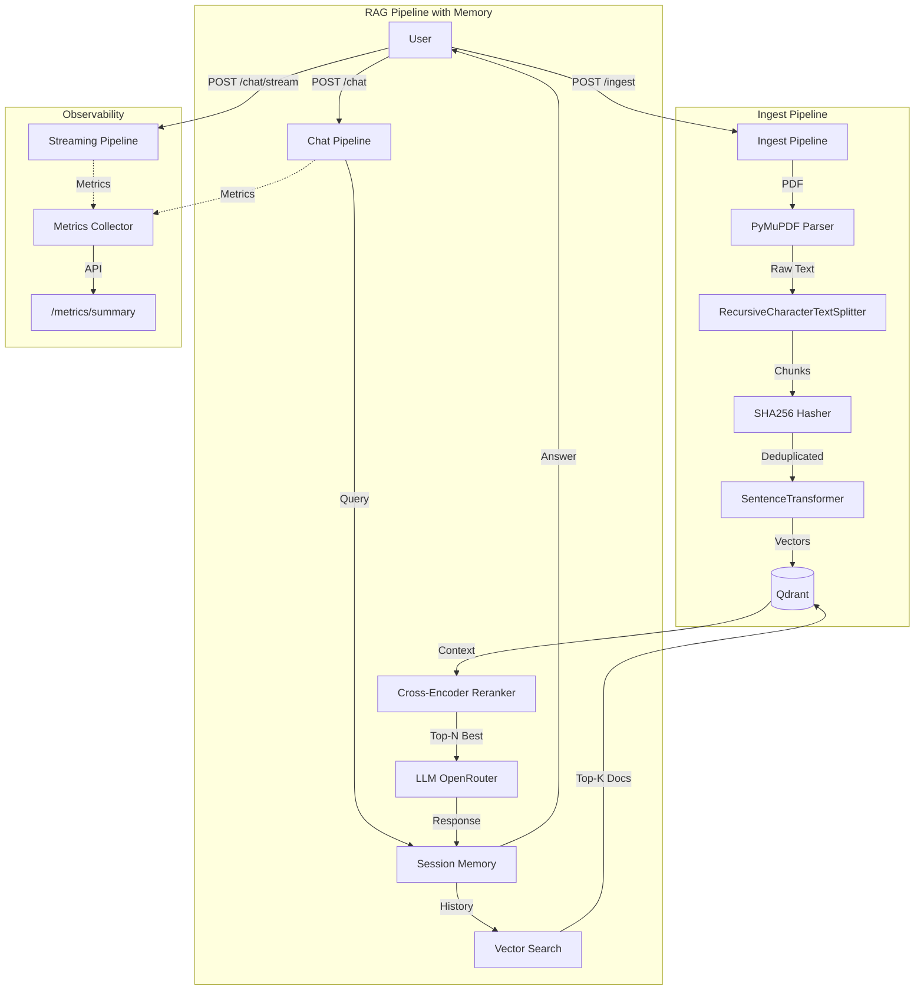

# Production RAG AI Chat Agent

A production-grade retrieval augmented generation (RAG) system built with FastAPI, LangChain, Qdrant, and OpenRouter. This project demonstrates a scalable, containerized architecture for ingesting PDF documents and performing context-aware chat operations with advanced features including streaming responses, conversational memory, reranking, and comprehensive observability.

[](https://opensource.org/licenses/MIT)
[](https://www.python.org/downloads/)
[](https://www.docker.com/)

---

## 🚀 Features

### Core RAG Pipeline

- **PDF Ingestion** — Upload and process PDF documents with SHA256 deduplication
- **Semantic Search** — Vector-based retrieval using sentence-transformers (all-MiniLM-L6-v2)
- **Context-Aware Chat** — Ask questions about ingested documents with source attribution

### Advanced Features

- **Streaming Responses** — Real-time token streaming for improved UX
- **Conversational Memory** — Multi-turn conversations with session management
- **Reranking** — Two-stage retrieval with cross-encoder reranking for 20-30% quality improvement
- **Multi-Collection Support** — Data isolation per user/project/tenant
- **Observability** — Built-in metrics, performance tracking, and optional LangSmith tracing

---

## Architecture Overview



### Data Flow

**Ingestion:**

```
PDF → Parse → Chunk → Hash (dedup) → Embed (384-dim) → Qdrant
```

**Query (with all features):**

```
Query → Embed → Qdrant Search (top-10) → Rerank (top-3) →
Load Session Memory → LLM Generate (with history) →
Save to Memory → Stream Response → Record Metrics
```

---

## Project Structure

```
rag-agent/
├── app/
│   ├── api/
│   │   ├── routes/
│   │   │   ├── ingest.py         # Document ingestion
│   │   │   ├── chat.py           # Standard chat endpoint
│   │   │   ├── stream.py         # Streaming chat endpoint
│   │   │   ├── collections.py    # Collection management
│   │   │   ├── sessions.py       # Session/memory management
│   │   │   └── metrics.py        # Observability endpoints
│   │   └── dependencies.py       # FastAPI DI
│   ├── core/
│   │   ├── config.py             # Settings management
│   │   ├── logging.py            # Structured logging
│   │   ├── metrics.py            # Metrics collection
│   │   └── tracing.py            # LangSmith integration
│   ├── pipelines/
│   │   ├── ingest.py             # Ingestion orchestration
│   │   └── rag.py                # RAG pipeline with memory
│   ├── services/
│   │   ├── parser.py             # PDF text extraction
│   │   ├── chunker.py            # Text splitting
│   │   ├── embedder.py           # Embedding generation
│   │   ├── reranker.py           # Cross-encoder reranking
│   │   ├── hasher.py             # SHA256 deduplication
│   │   ├── memory.py             # Conversation memory
│   │   └── vector_store.py       # Qdrant operations
│   ├── schemas/
│   │   ├── chat.py               # Chat request/response models
│   │   ├── ingest.py             # Ingestion models
│   │   ├── collections.py        # Collection models
│   │   └── sessions.py           # Session models
│   ├── main.py                   # FastAPI application
│   ├── Dockerfile
│   └── requirements.txt
├── qdrant_storage/               # Persisted vector data
├── docker-compose.yml
├── .env.example
├── .gitignore
├── LICENSE
└── README.md
```

---

## Tech Stack

| Component            | Technology                            | Purpose                                          |
| -------------------- | ------------------------------------- | ------------------------------------------------ |
| **Framework**        | FastAPI (Python 3.11)                 | High-performance async API                       |
| **Orchestration**    | LangChain                             | LLM workflow management                          |
| **Vector Database**  | Qdrant                                | Persistent vector storage                        |
| **LLM Provider**     | OpenRouter                            | Access to Google Gemma 3 27B                     |
| **Embeddings**       | sentence-transformers                 | Local embedding generation (all-MiniLM-L6-v2)    |
| **Reranking**        | sentence-transformers                 | Cross-encoder reranking (ms-marco-MiniLM-L-6-v2) |
| **Memory**           | In-Memory (upgradeable to Redis)      | Conversation state management                    |
| **Containerization** | Docker & Docker Compose               | Reproducible deployment                          |
| **Observability**    | Custom Metrics + LangSmith (optional) | Performance monitoring                           |

---

## Quick Start

### Prerequisites

- Docker & Docker Compose
- OpenRouter API Key ([Get one free](https://openrouter.ai))

### Installation

```bash
# 1. Clone the repository
git clone https://github.com/SRV-YouSoRandom/ragagent.git
cd ragagent

# 2. Configure environment
cp .env.example .env
nano .env  # Add your OPENROUTER_API_KEY

# 3. Build and run
docker compose up --build -d

# 4. Verify it's running
curl http://localhost:8000/health
```

The API will be available at `http://localhost:8000`

Swagger UI: `http://localhost:8000/docs`

---

## API Usage

### 1. Ingest Documents

Upload PDF documents to the vector store.

```bash
curl -X POST http://localhost:8000/api/v1/ingest \
  -F "file=@document.pdf" \
  -F "collection_name=my_docs"
```

**Response:**

```json
{
  "filename": "document.pdf",
  "doc_hash": "a3f5c2...",
  "total_chunks": 42,
  "new_chunks_indexed": 42,
  "collection_name": "my_docs",
  "message": "Document ingested successfully."
}
```

### 2. Chat (Standard)

Ask questions with source attribution.

```bash
curl -X POST http://localhost:8000/api/v1/chat \
  -H "Content-Type: application/json" \
  -d '{
    "question": "What is the main topic?",
    "collection_name": "my_docs",
    "session_id": null
  }'
```

**Response:**

```json
{
  "answer": "Based on the document, the main topic is...",
  "sources": [
    {
      "filename": "document.pdf",
      "score": 0.923,
      "rerank_score": 0.987
    }
  ],
  "collection_name": "my_docs",
  "session_id": "a1b2c3d4-5e6f-..."
}
```

### 3. Chat (Streaming)

Stream responses in real-time.

```bash
curl -X POST http://localhost:8000/api/v1/chat/stream \
  -H "Content-Type: application/json" \
  -d '{
    "question": "Explain this in detail",
    "session_id": "a1b2c3d4-5e6f-..."
  }' \
  --no-buffer
```

Tokens appear as they're generated!

### 4. Multi-Turn Conversations

The system remembers context within a session.

```bash
# First question
curl -X POST http://localhost:8000/api/v1/chat \
  -H "Content-Type: application/json" \
  -d '{"question": "What is quantum computing?"}'

# Follow-up (use returned session_id)
curl -X POST http://localhost:8000/api/v1/chat \
  -H "Content-Type: application/json" \
  -d '{
    "question": "How does it compare to classical computing?",
    "session_id": "<session_id_from_previous_response>"
  }'
```

### 5. Collection Management

```bash
# Create collection
curl -X POST http://localhost:8000/api/v1/collections \
  -H "Content-Type: application/json" \
  -d '{"name": "project_alpha"}'

# List collections
curl http://localhost:8000/api/v1/collections

# Get collection stats
curl http://localhost:8000/api/v1/collections/project_alpha

# Delete collection
curl -X DELETE http://localhost:8000/api/v1/collections/project_alpha
```

### 6. Session Management

```bash
# List active sessions
curl http://localhost:8000/api/v1/sessions

# Get conversation history
curl http://localhost:8000/api/v1/sessions/{session_id}/history

# Clear session
curl -X DELETE http://localhost:8000/api/v1/sessions/{session_id}
```

### 7. Metrics & Observability

```bash
# Get aggregated metrics
curl http://localhost:8000/api/v1/metrics/summary

# Get recent queries
curl http://localhost:8000/api/v1/metrics/recent?limit=20
```

**Example metrics response:**

```json
{
  "total_queries": 150,
  "successful_queries": 147,
  "failed_queries": 3,
  "avg_latency_ms": 1234.5,
  "avg_docs_retrieved": 10.0,
  "avg_docs_after_rerank": 3.0,
  "p95_latency_ms": 1850.2,
  "p99_latency_ms": 2100.5
}
```

---

## Configuration

Edit `.env` to customize behavior:

```env
# LLM Configuration
OPENROUTER_API_KEY=your_key_here
LLM_MODEL=google/gemma-3-27b-it:free

# Embedding & Reranking
EMBEDDING_MODEL=all-MiniLM-L6-v2
RERANKER_MODEL=cross-encoder/ms-marco-MiniLM-L-6-v2

# RAG Parameters
CHUNK_SIZE=512
CHUNK_OVERLAP=64
TOP_K=5              # Initial retrieval
RERANK_TOP_K=3       # After reranking

# Observability (Optional)
LANGSMITH_TRACING=false
LANGSMITH_API_KEY=
LANGSMITH_PROJECT=rag-agent
```

---

## Key Design Decisions

| Decision                    | Reasoning                                                           |
| --------------------------- | ------------------------------------------------------------------- |
| **all-MiniLM-L6-v2**        | Fast, lightweight (384-dim), runs fully local without API costs     |
| **Cross-Encoder Reranking** | 20-30% quality improvement with minimal latency cost (~100ms)       |
| **SHA256 Hashing**          | Prevents re-indexing duplicate content at document and chunk levels |
| **Qdrant over FAISS**       | Persistent storage, production-ready, REST API, easier scaling      |
| **OpenRouter**              | Access to top-tier models without local GPU requirements            |
| **In-Memory Sessions**      | Fast, simple, upgradeable to Redis for multi-instance deployments   |
| **LRU Caching**             | Avoids expensive model re-initialization per request                |
| **FastAPI Lifespan**        | Ensures resources are ready before serving traffic                  |
| **Streaming by Default**    | Better UX, lower perceived latency                                  |
| **Two-Stage Retrieval**     | Fast vector search (top-10) + accurate reranking (top-3)            |

---

## Docker Commands

```bash
# View logs
docker compose logs -f app

# Rebuild after code changes
docker compose up --build -d

# Stop services
docker compose down

# Restart specific service
docker compose restart app

# Shell into container
docker exec -it rag-app bash

# View Qdrant dashboard
# Open http://localhost:6333/dashboard

# Nuclear reset (deletes all data)
docker compose down -v && rm -rf qdrant_storage/
```

---

## Advanced Features

### Reranking Pipeline

Two-stage retrieval significantly improves answer quality:

```
Query → Vector Search (cosine similarity, top-10)
      ↓
      Cross-Encoder Reranking (semantic scoring, top-3)
      ↓
      LLM Generation
```

**Impact:** 20-30% improvement in relevance scores with minimal latency cost.

### Conversational Memory

Uses LangChain's `ConversationBufferWindowMemory` to maintain context:

- Keeps last 5 Q&A exchanges per session
- Enables follow-up questions like "tell me more" or "what about X?"
- Session-based isolation (in-memory, upgradeable to Redis)

### Observability Stack

**Metrics Collected:**

- Request latency (total, embedding, retrieval, reranking, LLM)
- Retrieval quality (scores, document counts)
- Success/failure rates
- p95/p99 latency percentiles

**Optional LangSmith Integration:**

- Full LLM call tracing
- Token usage tracking
- Chain visualization
- Production debugging

---

## Testing

```bash
# Health check
curl http://localhost:8000/health

# API docs (interactive)
open http://localhost:8000/docs

# Test ingestion
curl -X POST http://localhost:8000/api/v1/ingest \
  -F "file=@test.pdf"

# Test chat
curl -X POST http://localhost:8000/api/v1/chat \
  -H "Content-Type: application/json" \
  -d '{"question": "test"}'

# Test metrics
curl http://localhost:8000/api/v1/metrics/summary
```

---

## Future Enhancements

### Planned Improvements

- [ ] **Redis Integration** — Persist conversation memory across restarts
- [ ] **Prometheus Metrics** — Industry-standard observability with Grafana dashboards
- [ ] **Rate Limiting** — API throttling with SlowAPI
- [ ] **Authentication** — JWT-based user authentication
- [ ] **Hybrid Search** — Combine vector search with BM25 keyword search
- [ ] **Multi-Modal Support** — Images, tables, charts extraction
- [ ] **Query Expansion** — HyDE (Hypothetical Document Embeddings)
- [ ] **Response Caching** — Cache common queries with Redis
- [ ] **Batch Processing** — Async ingestion pipeline for large document sets
- [ ] **WebSocket Support** — Real-time bi-directional communication

### Production Upgrade Path

**Memory → Redis:**

```python
from langchain.memory import RedisChatMessageHistory

message_history = RedisChatMessageHistory(
    url="redis://localhost:6379",
    session_id=session_id
)
```

**Metrics → Prometheus:**

```python
from prometheus_client import Counter, Histogram

query_counter = Counter('rag_queries_total', 'Total queries')
query_latency = Histogram('rag_query_latency_seconds', 'Query latency')
```

**Rate Limiting:**

```python
from slowapi import Limiter

limiter = Limiter(key_func=get_remote_address)

@app.post("/chat")
@limiter.limit("10/minute")
async def chat(...):
    ...
```

---

## Contributing

Contributions are welcome! This project serves as a boilerplate for building production-grade RAG systems.

### How to Contribute

1. **Fork the repository**
2. **Create a feature branch**
   ```bash
   git checkout -b feature/amazing-feature
   ```
3. **Commit your changes**
   ```bash
   git commit -m 'Add amazing feature'
   ```
4. **Push to the branch**
   ```bash
   git push origin feature/amazing-feature
   ```
5. **Open a Pull Request**

### Contribution Guidelines

- Follow PEP 8 style guide
- Add tests for new features
- Update documentation
- Ensure Docker builds successfully
- Test with sample PDFs before submitting

### Areas for Contribution

- 🐛 Bug fixes
- ✨ New features (see Future Enhancements)
- 📝 Documentation improvements
- 🧪 Test coverage
- 🎨 UI/Frontend development
- 🔧 DevOps improvements (CI/CD, monitoring)

---

## License

This project is licensed under the MIT License - see the [LICENSE](LICENSE) file for details.

---

## Acknowledgments

- **LangChain** — LLM orchestration framework
- **Qdrant** — High-performance vector database
- **sentence-transformers** — State-of-the-art embeddings
- **FastAPI** — Modern Python web framework
- **OpenRouter** — Unified LLM API access

---

## Support

- **Issues:** [GitHub Issues](https://github.com/SRV-YouSoRandom/ragagent/issues)
- **Discussions:** [GitHub Discussions](https://github.com/SRV-YouSoRandom/ragagent/discussions)
- **Documentation:** See `/docs` endpoint when running locally

---

## Performance Benchmarks

Tested on modest hardware (4 vCPU, 8GB RAM):

| Operation                | Latency       | Notes                                  |
| ------------------------ | ------------- | -------------------------------------- |
| PDF Ingestion (10 pages) | ~2-3s         | Includes chunking, embedding, indexing |
| Vector Search            | ~50-100ms     | Top-10 retrieval from 10k chunks       |
| Reranking                | ~100-150ms    | Cross-encoder on top-10 candidates     |
| LLM Generation           | ~1-2s         | Depends on response length             |
| **Total Query Latency**  | **~1.5-2.5s** | Full pipeline with reranking           |

---

## 🌟 Star History

If you find this project useful, please consider giving it a ⭐!

---

**Built with ❤️ for the AI/ML community**
